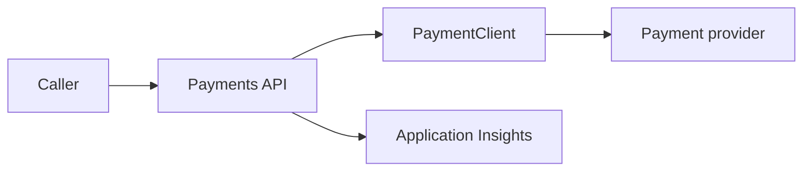

# Architecture

The Payments API is a small .NET 9 HTTP service that forwards payment requests to an external payment provider. `PaymentClient` owns provider communication and applies the repository retry policy before returning a transport-safe result.

Azure App Service hosts the API. Application Insights and a Log Analytics workspace provide telemetry and centralised diagnostics.
